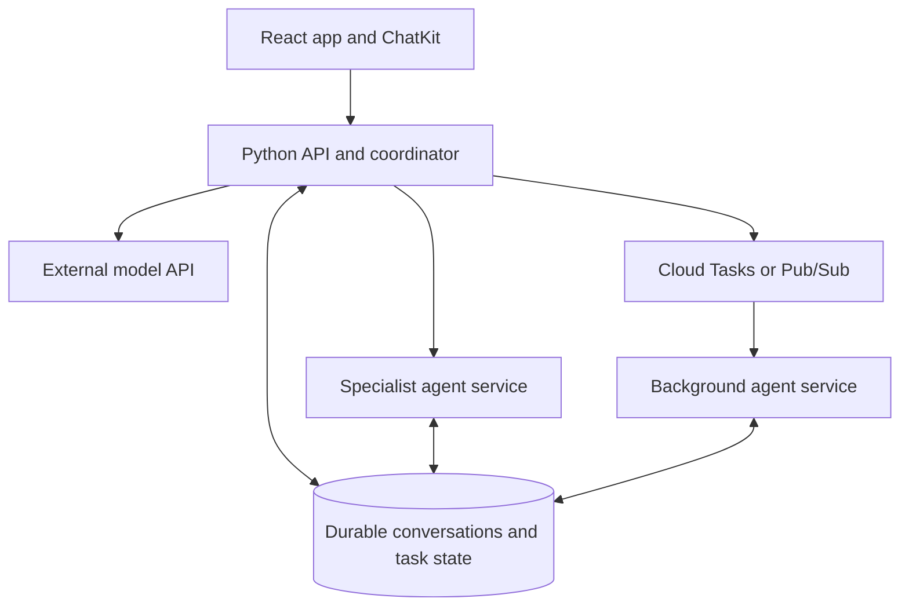

# LifeBuckets — Long-Term Architecture

Status: PROPOSED for Pablo's review and commit; discussion captured 2026-09-12.
This direction does not authorize implementation, cloud provisioning or a new sprint.
The [Sprint 004 hosted plan](../07-planning/sprints/sprint-004-chatkit-poc/05-hosted-deployment-plan.md) governs the immediate deployment.

## Direction

Keep React/TypeScript in the browser and Python on the server.
Use Firebase Hosting for the application, Firebase Authentication for identity and Firestore for durable product data.
Use React ChatKit for the assistant interface; the Python backend calls GPT through the OpenAI API.
GPT inference runs at the model provider; our container runs application logic, authentication and orchestration.
Keep provider credentials on the server, with Secret Manager binding for hosted execution.

## Current boundary and future additions

Sprint 004 provides a local chat proof with temporary server-memory conversations.
Its hosted plan proposes one Python Cloud Run instance at most, with zero allowed when idle.
Local color edits are not server synchronization; multi-agent tools, durable chats and shared usage limits are future work.
This document does not establish that the backend has been deployed or accepted in production.

## Proposed future arrangement

Arrows describe logical responsibilities; each database access still requires authorization.
Begin with multiple logical agents in one Python service when that is sufficient.
Separate an agent into its own service when permissions, dependencies, release cadence or scaling justify it.
An agent role is application behavior; a container instance is replaceable execution capacity.

## Evolution and acceptance

1. Finish and validate the bounded personal chat deployment.
2. Add durable conversations, shared limits and user isolation before enabling multiple instances/users.
3. Add a coordinator and narrowly scoped tools; require user approval for consequential actions.
4. Introduce specialist services and asynchronous work only when a concrete workflow needs them.

Each step requires its own approved plan, interfaces, tasks and evidence under repository governance.
Decide retention/deletion, model budgets, service objectives and tool permissions in those future plans.
See [container lifecycle and scaling](cloud-run-scaling.md) and [agent communication and messaging](agent-communication.md).
