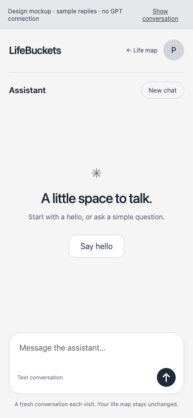
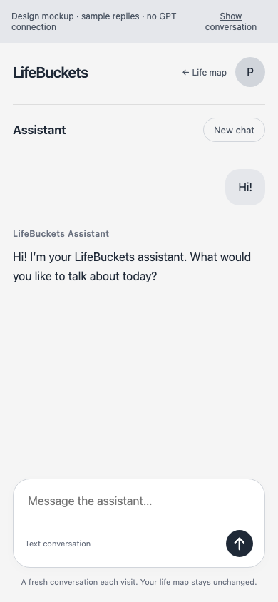
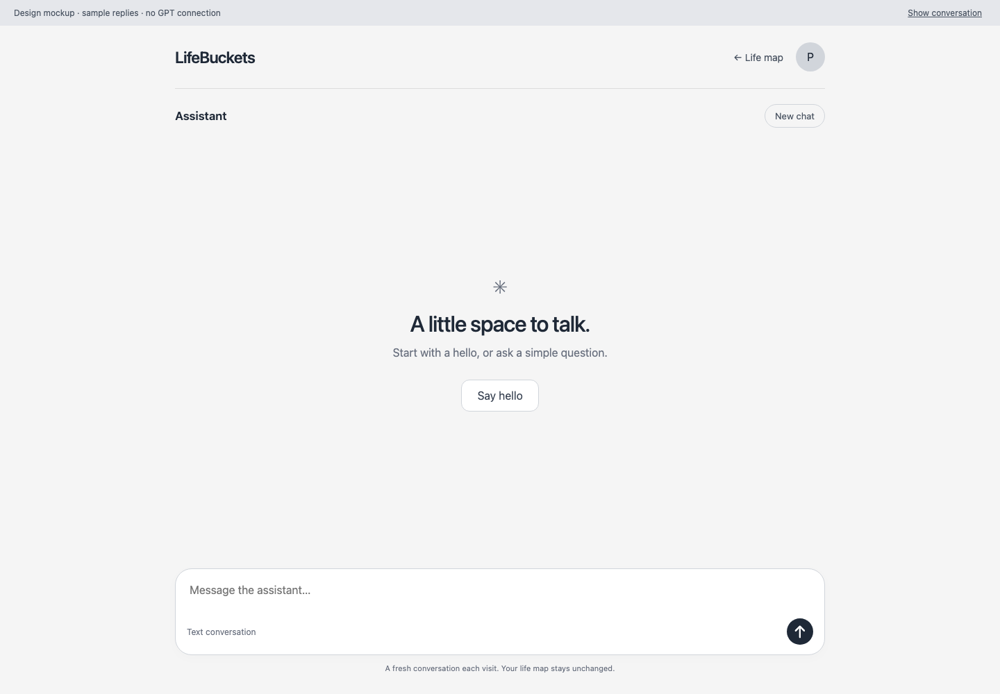
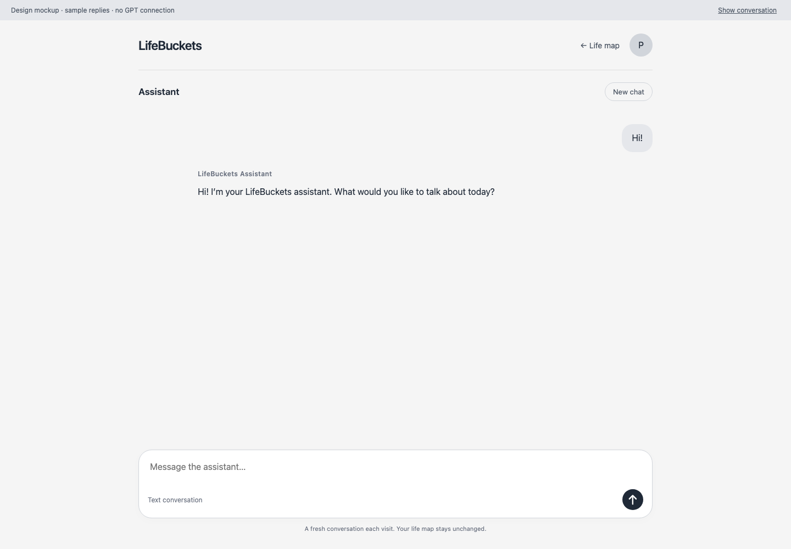

# Sprint 004 — Assistant Visual Specification

Status: PROPOSED; review and commit before UI implementation Tasks are finalized.
Source: Pablo's request for a LifeBuckets page with React ChatKit and server-side GPT.

## Reviewable mockup

[Open interactive mockup](assistant-chatkit.html).
The static prototype simulates a greeting and follow-up; it does not load ChatKit or call GPT.
Production implementation will use React ChatKit; exact SDK styling remains subject to validation.
The design review banner is outside the proposed product UI and is not a production requirement.

## Phone

## Desktop

## Intended behavior

LifeBuckets header, account identity and Life map return link frame an isolated Assistant page.
Welcome offers Say hello; a real server-backed response replaces the empty state in implementation.
Messages scroll above a bottom composer with text and send action; New chat resets the view.
Retain neutral gray surfaces and charcoal text; do not use ChatGPT logos or imply a ChatGPT account.
No microphone, uploads or domain-action controls in this first proof.
The return link in this mockup opens a simplified navigation sketch, not the existing life map.
Loading uses an assistant progress state; errors provide retry and keep unsent text.
Offline disables sending with an explicit connection message; expired auth requires sign-in.
These error states are specified here but not simulated by this mockup.

## Checks and limits

Rendered at 390px and 1440px; checked 320px overflow and the sample greeting interaction.
Phone conversation image visually inspected; physical keyboard behavior remains implementation evidence.
All depicted messages are sample content; no personal data, model calls or production changes.
