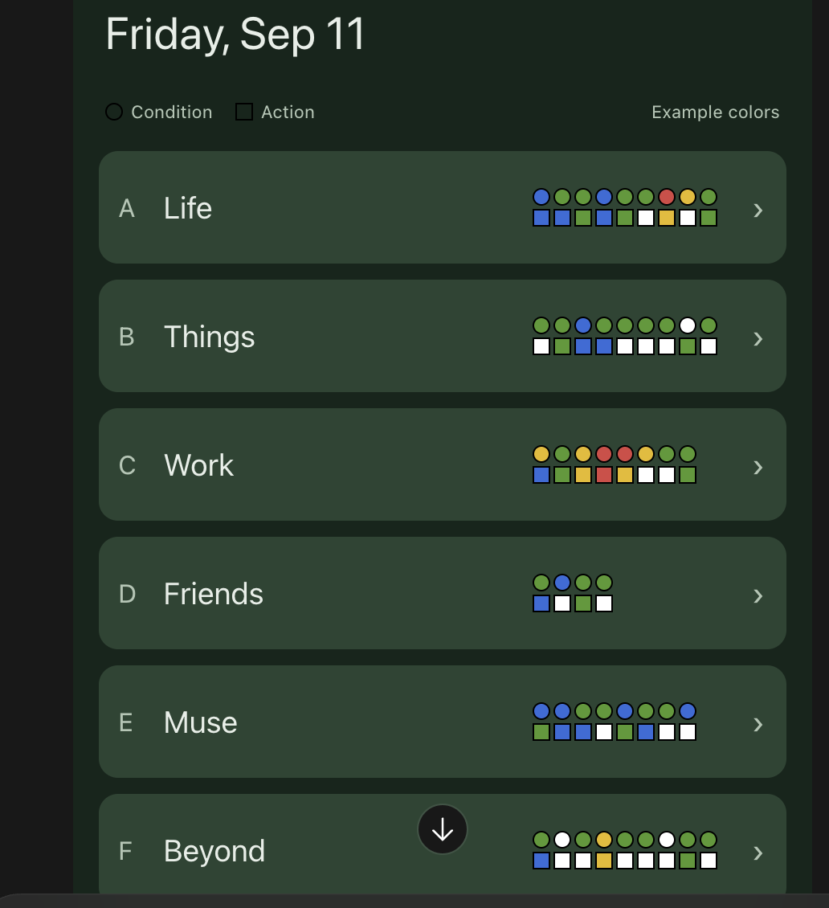

# Category Status Matrix — Visual Specification

Status: PROPOSED; Sprint 003 design dependency for Pablo's review and commit.

## Original concept image

Source: Pablo's screenshot of the interactive mockup, supplied September 11, 2026.
Preserved unchanged; the screenshot crops the lower categories and includes a viewer overlay.
Colors are illustrative, not personal data, seed values, or verified application behavior.

## Refinements that supersede the image

- Remove the category count and chevron; the entire row still expands the category.
- Align each matrix to the inner right edge, including categories with fewer luckets.
- Use only actual lucket columns, up to 10; do not reserve blank columns.
- Keep condition circles above action squares, one pair per lucket in list order.
- Keep marks tightly spaced, with a thin black border and the existing five colors.
- The date, example-colors caption, and legend are context, not new Sprint 003 requirements.

## Detailed behavior and review

The [component contract](../../07-planning/sprints/sprint-003-category-status-matrix/02-components-and-contract.md)
defines dimensions, empty/unknown states, overflow, accessibility, and local-edit behavior.
The [Sprint Plan](../../07-planning/sprints/sprint-003-category-status-matrix/01-sprint-plan.md)
defines scope and acceptance; these refinement notes take precedence over the original image.
Review the implementation at 320px and desktop widths against both image and refinements.
Capture implementation screenshots separately as test evidence; do not overwrite this concept.
